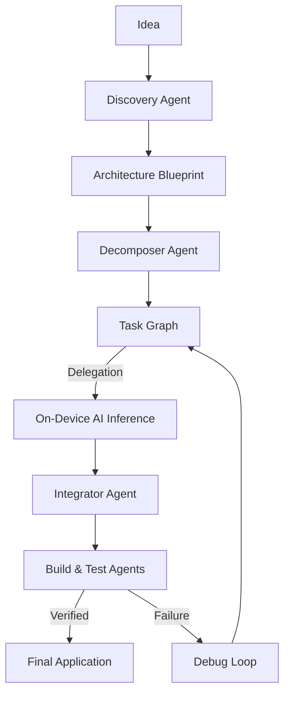

# Kindle 🔥

### The Autonomous Multi-Agent Development Platform

**Kindle** is a cutting-edge, AI-native application engineering platform that transforms high-level creative ideas into production-ready software. By orchestrating a sophisticated fleet of specialized AI agents, Kindle handles the entire development lifecycle—from discovery and architectural design to implementation, testing, and self-healing.

> **Think it. Kindle builds it.**

## 🚀 Key Features

*   **Universal Prompt Delegation**: A hybrid architecture that allows the backend to orchestrate the "Lang Graph" while delegating heavy inference tasks to the client's local hardware.
*   **On-Device AI Inference**: Integrated with `llama_cpp_dart` (v0.9.x), Kindle runs quantized GGUF models (like Qwen2.5-Coder) directly on Windows, macOS, Android, and iOS using background Dart Isolates for zero UI lag.
*   **Task-Based Agent Graph**: An advanced orchestration engine inspired by LangGraph that manages complex task dependencies and parallel multi-agent execution waves.
*   **Granular Atomic Decomposition**: Automatically breaks features into "atomic" units (max 1-2 files per agent). This ensures that even small local models can generate high-precision code without logical drift.
*   **Download-on-Launch Architecture**: A "thin client" approach that downloads optimized AI models (~1.2GB) on first launch, ensuring the app remains lightweight while providing full offline intelligence.
*   **Deep Behavioral Simulation**: A robust mock engine that mimics real LLM responses, allowing developers to verify project "plumbing" and integration logic with zero API cost.
*   **Intelligent MD5 Caching**: Persistent disk-based response caching for cloud providers, ensuring you never pay for the same prompt twice.

## 🤖 The Kindle Agent Fleet

Kindle leverages specialized, role-based agents for maximum precision:

*   **Discovery & Product Agents** — Refines raw ideas into structured requirements and product blueprints.
*   **Architecture Agent** — Designs the system using industry-standard patterns (Clean Architecture, BLoC, MVVM).
*   **Decomposer Agent** — The strategist that splits features into atomic sub-tasks optimized for the chosen AI provider.
*   **Coding Agents** — Specialized implementation agents for UI, Domain, and Data layers.
*   **Integrator Agent** — The master weaver that merges parallel outputs, resolves conflicts, and wires up Dependency Injection (DI) and Routing.
*   **Build & Testing Agents** — The quality guardians that perform real-time verification and automated debugging loops.

## 🛠️ Technology Stack

*   **Frontend**: Flutter / Dart (Cross-Platform) using `provider` and `BLoC` for state management.
*   **Backend**: Node.js / TypeScript powered by the high-performance **Fastify** framework.
*   **Database**: PostgreSQL with Prisma ORM.
*   **AI Engine**: `llama_cpp_dart` (0.9.0-dev) for on-device inference; OpenRouter for cloud scaling.
*   **Networking**: `Dio` with advanced stream-based downloading and progress tracking.

## ⚙️ How It Works

---

**Kindle is shifting software development from manual implementation to high-level orchestration—empowering creators to build entire ecosystems with the power of autonomous AI.**
