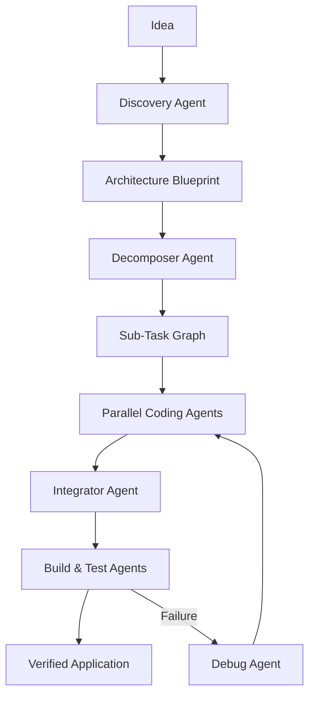

# Kindle 🔥

### The Autonomous Multi-Agent Development Platform

**Kindle** is a next-generation, AI-driven application builder that transforms high-level ideas into production-ready software through an autonomous multi-agent ecosystem. Unlike traditional code assistants, Kindle orchestrates a fleet of specialized agents to design, implement, integrate, and verify entire applications.

> **Think it. Kindle builds it.**

## 🚀 Key Features

*   **Task-Based Agent Graph**: A sophisticated orchestration engine (inspired by LangGraph) that manages complex dependencies and parallel execution across multiple AI agents.
*   **Granular Decomposition**: Automatically breaks down large features into layer-specific sub-tasks (UI, Domain, Data, Integration). Each sub-task is load-balanced to ~20% complexity to ensure high-precision generation.
*   **Deep Behavioral Simulation**: A zero-cost, zero-load mock engine that mimics real LLM behavior. Perfect project "plumbing" and integration logic without consuming API credits or hardware resources.
*   **Autonomous Self-Healing**: Integrated Build and Testing agents that detect failures, analyze logs, and trigger automated debugging loops to reach a verified state.
*   **Intelligent Response Caching**: Disk-based MD5 caching for AI responses, minimizing OpenRouter API consumption and ensuring instant re-runs.
*   **Hybrid Provider Strategy**: Seamless switching between OpenRouter (Cloud), Ollama (Local), and Simulation modes based on environment credentials.

## 🤖 The Kindle Agent Fleet

Kindle operates through specialized, role-based agents:

*   **Discovery & Product Agents** — Refine ideas into actionable requirements and product specs.
*   **Architecture & Tech Agents** — Blueprint the system using industry-standard patterns (Clean Architecture, BLoC, MVVM).
*   **Decomposer Agent** — The strategist that splits features into granular sub-tasks for parallel processing.
*   **Coding Agents** — Specialized implementation agents for UI, Domain, and Data layers.
*   **Integrator Agent** — The master weaver that merges code, resolves conflicts, and wires up Dependency Injection (DI) and Routing.
*   **Build & Testing Agents** — The quality guardians that verify every line of generated code.

## 🛠️ Technology Stack

*   **Frontend**: Flutter / Dart (Mobile, Desktop, Web) with BLoC state management.
*   **Backend**: Node.js / TypeScript using the high-performance **Fastify** framework.
*   **Database**: PostgreSQL with Prisma ORM.
*   **AI**: OpenRouter (Cloud), Ollama (Local), and Custom Simulation Provider.

## ⚙️ How It Works

## 🗺️ Progress

*   [x] Task-Based Agent Graph Orchestration
*   [x] Multi-Agent Parallel Execution
*   [x] Deep Simulation Engine (Zero-Cost Dev)
*   [x] Intelligent Response Caching
*   [x] Role-Based Specialized Coding
*   [x] Automated Build & Test Integration
*   [ ] Multi-Framework Support (React, Native)
*   [ ] Cloud Workspace Deployment

---

**Kindle is exploring the frontier of autonomous software engineering—turning the development process into a high-level creative direction rather than a manual implementation struggle.**
